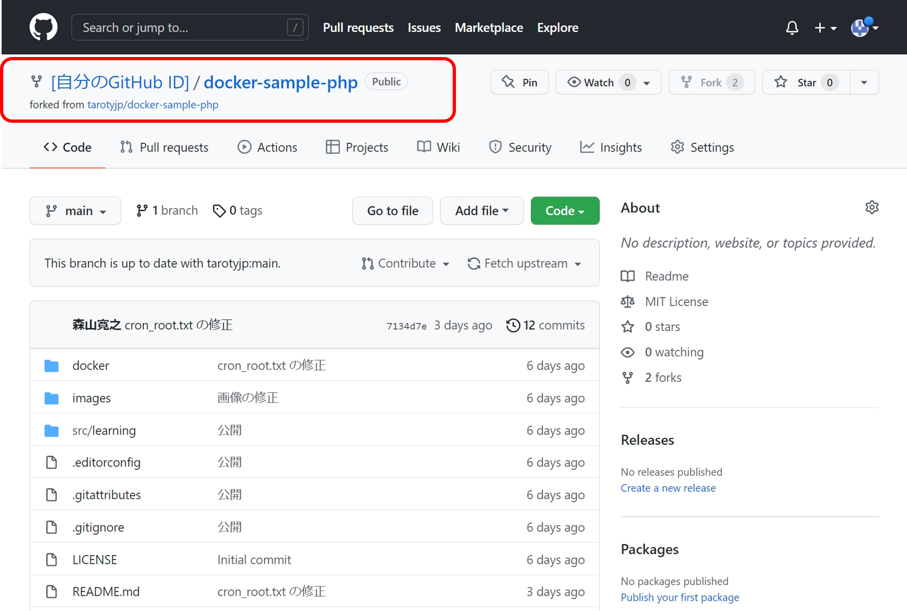

# 本気のサンプルシリーズの使い方

この使い方は、本気のサンプルシリーズを学習者のパソコンにダウンロードする方法をおよびDockerでコンテナを起動するところまでを解説します。  

gitを使ったことな人もいるので、ダウンロードの方法はgitを使った方法とgitを使わない方法で分けてます。

サンプルは今後も追加される可能性ありますが、学習者のパソコンにダウンロードする方法はいずれも同じです。

この使い方では「PHP版 本気の Docker サンプル」を例に説明をしています。

[PHP版 本気の Docker サンプル](https://github.com/tarotyjp/docker-sample-php)

なお、VS Codeを利用して学んでいる方が多いことが予想されるため、VS Codeを利用することを前提に説明しています。

---

## gitを使ったことない人向け

こちらの方法はzip形式で圧縮されたファイルをダウンロードして利用します。  
gitを利用できる方でも、サクッと試してみたい方はこちらでご利用ください。

大まかな流れは下記のとおりです。

1. 利用するサンプルのGitHubページを開く
2. zip形式でダウンロードする
3. zipを展開して利用する

では一つずつ一緒に見ていきましょう。

### 1. 利用するサンプルのGitHubページを開く

[PHP版 本気の Docker サンプル](https://github.com/tarotyjp/docker-sample-php)


### 2. zip形式でダウンロードする

「Code」と書かれた緑のボタンを押して「Download ZIP」をクリックして保存します。


### 3. zipを展開して利用する

zipファイルを展開する前に展開先を決めておきましょう。  
回答すると「docker-sample-php-main」というフォルダができます。

フォルダ名は適宜自分の好みで修正してよいですが、フォルダ名には下記文字のみ利用するとよいです。

- 半角英数字
- 半角の `-` (ハイフン) と `_` (アンダーバー)

プログラミングを学習する際には上記文字列でフォルダ名やファイル名を付ける習慣をつけるとよいです。

展開されたフォルダをVS Codeで開きましょう。  
下記画像のようにcloneされたプロジェクトが表示されれば準備完了です。


ここから先は 「[Dockerの利用方法](#Dockerの利用方法)」をご参照ください

---

## gitを利用する人向け

こちらの方法は `git clone` を利用してダウンロードします。  

大まかな流れは下記のとおりです。

1. 利用するサンプルのGitHubページを開く
2. リポジトリをフォーク
3. フォークしたリポジトリのURLをコピー
4. git cloneする

では一つずつ一緒に見ていきましょう。

### 1. 利用するサンプルのGitHubページを開く

[PHP版 本気の Docker サンプル](https://github.com/tarotyjp/docker-sample-php)


### 2. リポジトリをフォーク

画面右上の `Fork` アイコンをクリックしてフォークします。


しばらく下記のような画面が表示されます。


Forkが完了すると自動的に画面が更新されます。  
画面左上を見ると、ご自身のリポジトリとしてForkされていることが分かります。



### 3. フォークしたリポジトリのURLをコピー

「Code」と書かれた緑のボタンを押してURLをコピーします。


### 4. git cloneする

VS Codeを開き下記画像を参考に `git clone` の準備をして `Enterキー` を押します。


clone先のフォルダを選択する画面が出ますので、作業ディレクトリを指定してください。
なお、clone時には作業ディレクトリの配下にリポジトリ名でフォルダが自動的に作成されます。


画像はWindowsでの例ですが、この例では下記のように指定しています。

- 作業フォルダ： `D:\workspace\support\sample`
- clone後に作成されるパス： `D:\workspace\support\sample\docker-sample-php`

cloneが完了すると下記のようにclone後のアクションを聞かれるので「開く」をクリックしましょう。


下記画像のようにcloneされたプロジェクトが表示されれば準備完了です。


ここから先は 「[Dockerの利用方法](#Dockerの利用方法)」をご参照ください

---

## Dockerの利用方法

大まかな流れは下記のとおりです。

1. ターミナルを開く
2. Dockerコマンドを実行する
   1. `docker-compose build --no-cache`
   2. `docker-compose build up -d`

では一つずつ一緒に見ていきましょう。
   
### 1. ターミナルを開く

メニューからターミナルを開きます。


### 2. Dockerコマンドを実行する

ターミナルでコマンドを２つ実行します。

```shell
docker-compose build --no-cache
```

こんな感じで終了すればOKです。


```shell
docker-compose up -d
```
こんな感じで終了すればOKです。


