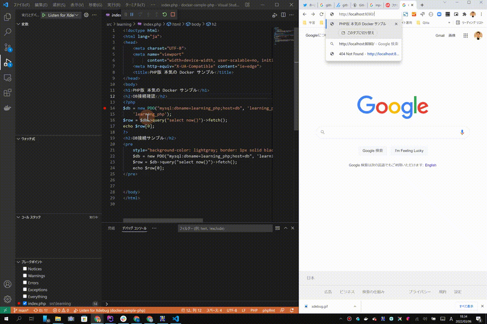
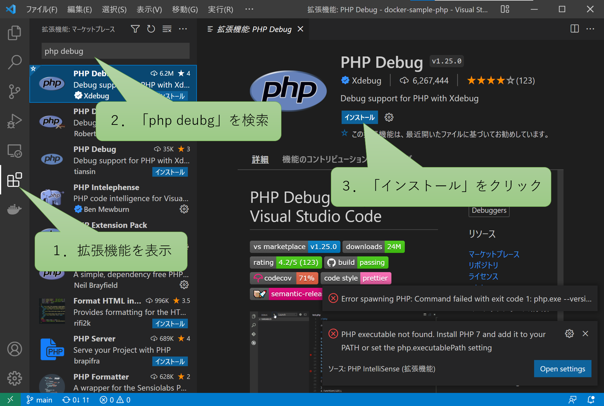
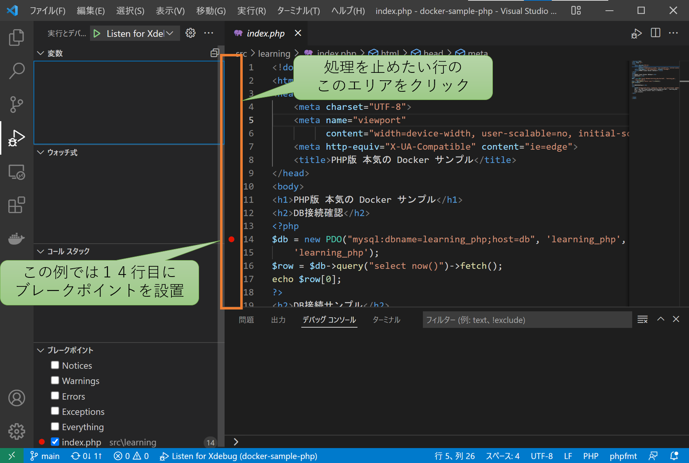
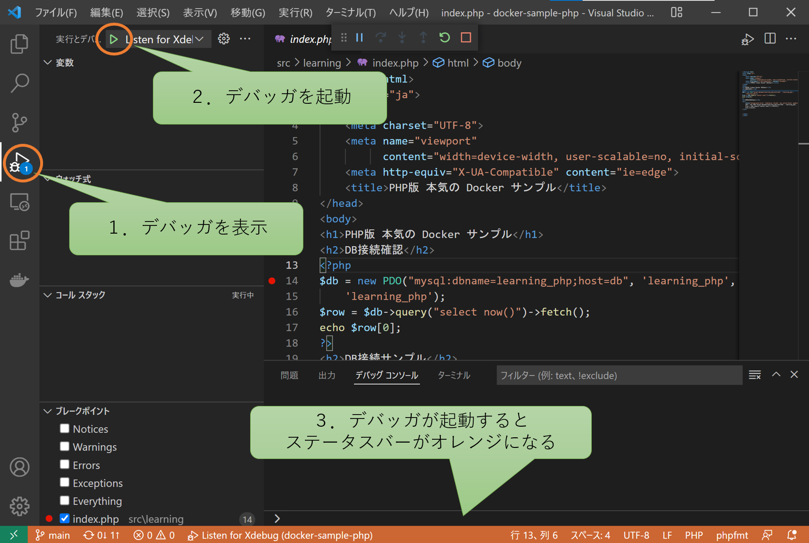
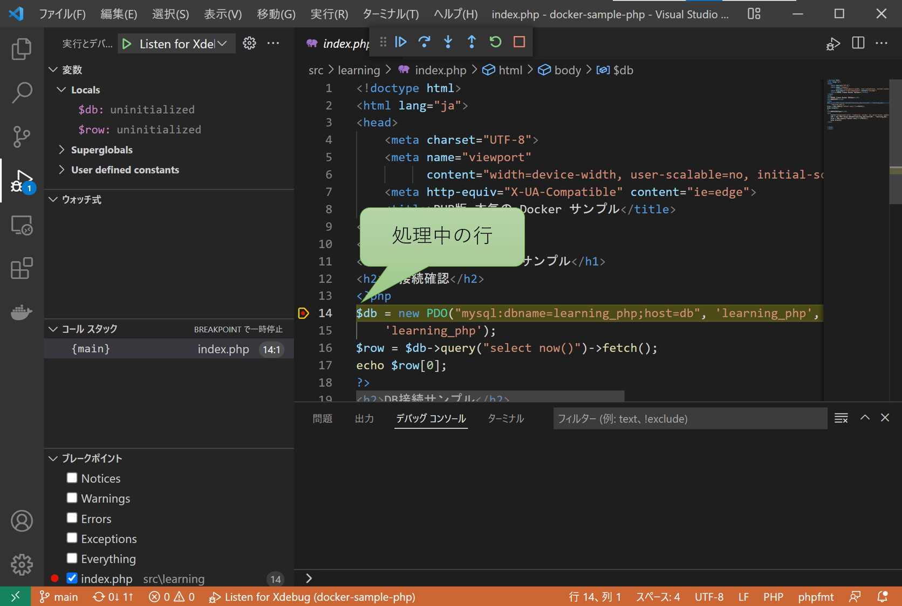
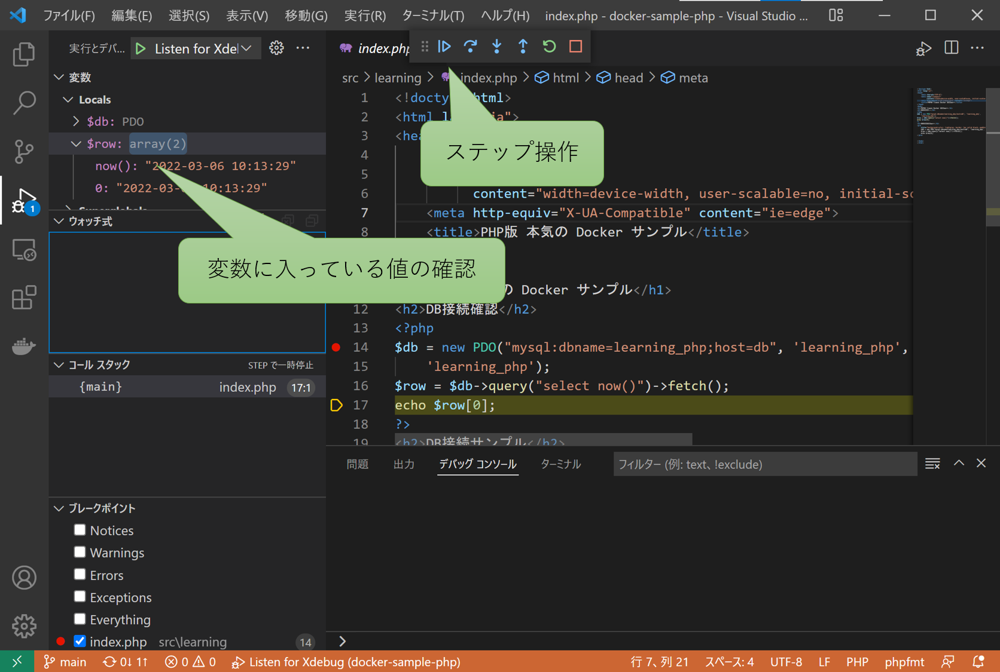
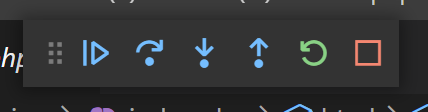

# VSCode で Xdebug を利用する方法

本気のDockerサンプルシリーズではXdebugが利用できるように構成されています。

Xdebugとは下記GIF画像のようにPHPの処理を１行ごとに確認しながらデバッグを可能にする拡張機能のことです。



ただ、Xdebugはそれなりに負荷が高いため、このDockerサンプルの初期状態では無効になっています。

ここでは、このDockerサンプルでXdebugを有効にする方法を説明します。

Xdebug自体の詳しい使い方は別途ご自身で調べてみてください。

また、VSCodeでXdebugを利用するためには `PHP Debug` というVSCodeの拡張機能をインストールする必要があります。  
まだインストールできていない方は拡張機能のインストールを済ませておきましょう。



---

## Xdebugを有効にする方法

大まかな流れは下記のとおりです。

1. Dockerコンテナが起動していれば終了しておく
2. `xdebug.ini` のコメントを外す
3. Dockerコンテナを起動する

では一つずつ一緒に見ていきましょう。

### 1. Dockerコンテナが起動していれば終了しておく

`xdebug.ini` の修正後には再読み込みが必要なので、Dockerコンテナが起動している方は終了しておきましょう。

```shell
docker-compose down
```

### 2. `xdebug.ini` のコメントを外す

`docker/php/xdebug.ini` を開き行頭にある全てのコメント（`;` セミコロン） を削除します。

修正前

```ini
;[xdebug]
;zend_extension = xdebug
;xdebug.mode = debug
;xdebug.client_host = host.docker.internal
;xdebug.idekey = xdebug_idekey
;xdebug.start_with_request = yes
```

修正語

```ini
[xdebug]
zend_extension = xdebug
xdebug.mode = debug
xdebug.client_host = host.docker.internal
xdebug.idekey = xdebug_idekey
xdebug.start_with_request = yes
```

### 3. Dockerコンテナを起動する

Dockerコンテナを起動します。

```shell
docker-compose up -d
```

---

## 動作確認

動作確認のための操作はおおよそ下記のとおりです。

1. ブレークポイントの設置
2. デバッガーの起動
3. ブラウザからアクセス
4. ステップ実行

では一つずつ一緒に見ていきましょう。

### 1. ブレークポイントの設置

`src/learning/index.php` を開き下記のようにブレークポイントを設置します。  
この例では１４行目に設置しています。



### 2. デバッガーの起動

下記画像の手順でデバッガーを起動します。



### 3. ブラウザからアクセス

ブラウザにアクセスすると、下記画像のように処理が中断します。
[http://localhost:8080/](http://localhost:8080/)



### 4. ステップ実行

画面上部にあるアイコンでステップを操作します。  
画面左側には中断している時点のローカル変数が表示されています。





ステップを操作するアイコンは左から順に説明します。

| 名前       | 動作                                                    |
|----------|-------------------------------------------------------|
| 続行       | 処理を再開します。<br>再開以降にブレークポイントがあればそこで止まります。               |
| ステップオーバー | 関数やメソッドの中には入らずに実行します。<br>関数やメソッドの中にブレークポイントがあれば停止します。 |
| ステップイン   | 関数やメソッドの中に入ってデバッグを継続します。                              |
| ステップアウト  | デバッグ中の関数やメソッドから出ます                                    |
| 再起動      | 処理を中断してデバッガを再起動します。                                   |
| 停止       | 処理を中断してデバッガを停止します。                                    |

